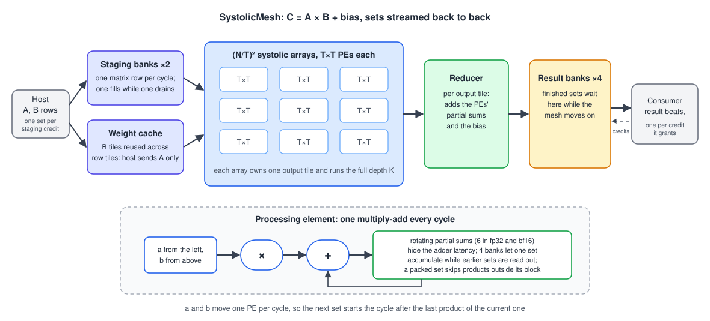

# SystolicMesh

**A scalable systolic-array matrix-multiply engine in SystemVerilog: C = A × B + bias in fp32, bf16 or int8, with sets streamed back to back.**

An N × N mesh of small T × T systolic arrays multiplies two N × N matrices with every processing element busy every cycle. It accepts the next matrix pair while the current one is still computing. SystolicMesh is the matrix engine of [SIENNA](https://github.com/SoHam-56/SIENNA), and it builds and verifies on its own.

| | |
|---|---|
| **81 ns** | to multiply two 16 × 16 matrices, start to result (fp32) |
| **7.8 TFLOPS** peak | from a 64 × 64 mesh: 4 096 multiply-accumulates every cycle |
| **89% of peak** sustained | streaming 32 × 32 matrix multiplies inside SIENNA |
| **bit-exact** | in fp32, bf16 and int8, against a Python model of the hardware |

Times assume a 950 MHz clock ([why](#performance)).

---

## Architecture



What makes it fast:

- **Every array runs the full depth.** Each T × T array owns one output tile and multiplies across the whole depth K, so all arrays finish together and no cross-array reduction is needed. That is N² processing elements in total. A depth-sliced mode (`COLLAPSE_K = 0`) trades N/T times more elements for a few cycles of latency.
- **Nothing waits for anything else.** Operands move one element per cycle through each array, so the next matrix pair enters the cycle after the last product of the current one. Two staging banks let the host load the next pair while the current one is broadcast.
- **Adder latency is hidden.** Each processing element rotates its products through several partial sums, so it takes a new product every cycle despite a multi-cycle adder. Four partial-sum banks and four result banks let one set accumulate while earlier sets are reduced and read out.
- **Weights stay on chip.** A weight cache holds reused B tiles, so the host sends only A. Partial sums can also stay in the elements across sets, so a deep K is accumulated without leaving the mesh.
- **Small jobs share the mesh.** A packed set puts independent small matrix multiplies on the diagonal of B, and each element skips products outside its own block.
- **One design, three formats.** The number format is a build parameter: fp32, bf16, or int8 with int32 sums. The multipliers and adders come from [ArithmeticLibrary](https://github.com/SoHam-56/ArithmeticLibrary).

---

## Performance

> All numbers are measured in cycle-accurate Verilator simulation. Times assume a **950 MHz** clock, the frequency the published TYTAN activation engine of the same project reached in a 45 nm process ([SIENNA](https://github.com/SoHam-56/SIENNA#publication)). Synthesis is planned.

**How latency is measured.** The testbench counts cycles from the start pulse to the result written to the result bank. For one set at N = 16, T = 4:

| Format | Cycles | Time |
|---|---|---|
| fp32 | 77 | 81 ns |
| bf16 | 72 | 76 ns |
| int8 | 53 | 56 ns |

The count does not depend on the data.

### Latency of one set (fp32)

| Matrix size | T = 2 | T = 4 | T = 8 | T = 16 | T = 32 | T = 64 |
|---|---|---|---|---|---|---|
| 16 × 16 | 62 ns | 81 ns | 144 ns | 372 ns | | |
| 32 × 32 | 79 ns | 98 ns | 161 ns | 388 ns | 1.25 µs | |
| 64 × 64 | | 132 ns | 195 ns | 422 ns | 1.28 µs | 4.62 µs |

Small tiles finish sooner, and doubling the matrix size adds little latency because the extra work is spread over more arrays in parallel. bf16 is 5 cycles faster and int8 24 cycles faster at every size.

### Throughput

The mesh accepts a new matrix pair every max(T + 2, K, T²) cycles, where K is the depth. That gives a peak of 486 GFLOPS at 16 × 16, 1.95 TFLOPS at 32 × 32 and 7.8 TFLOPS at 64 × 64. Inside SIENNA, streaming 32 × 32 sets from the host sustains 1.73 TFLOPS, 89% of peak.

### Compared with other matrix engines

Multiply-accumulates per cycle do not depend on the clock, so they compare designs fairly. Most edge accelerators are integer-only; SystolicMesh runs fp32, bf16 and int8 from one design.

| Design | Origin | MACs per cycle | Formats | Peak, as published |
|---|---|---|---|---|
| **SystolicMesh, 64 × 64** | this work, RTL | 4 096 | fp32, bf16, int8 | 7.8 TFLOPS at 950 MHz (assumed) |
| **SystolicMesh, 32 × 32** | this work, RTL | 1 024 | fp32, bf16, int8 | 1.95 TFLOPS at 950 MHz (assumed) |
| Google TPU v1 [1] | industry, 28 nm silicon | 65 536 | int8 (int16 at reduced rate) | 92 TOPS at 700 MHz |
| NVIDIA NVDLA, full configuration [2] | industry, open RTL | 2 048 int8, 1 024 int16 / fp16 | int8, int16, fp16 | not published |
| Arm Ethos-U65 [3] | industry, licensable IP | 256 or 512 | int8, int16 | 0.5–1 TOP/s at 1 GHz |
| Arm Ethos-U55 [3] | industry, licensable IP | 32 to 256 | int8, int16 | 64–512 GOP/s at 1 GHz |
| Gemmini, default [4] | academic, open RTL | 256 | int8 with int32 sums | not published |
| Eyeriss [5] | academic, 65 nm silicon | 168 | 16-bit fixed point | 33.6 GMAC/s at 200 MHz |

[1] Jouppi et al., ISCA 2017, [arXiv:1704.04760](https://arxiv.org/abs/1704.04760) · [2] [nvdla.org](http://nvdla.org/primer.html), [nv_full spec](https://github.com/nvdla/hw/blob/nvdlav1/spec/defs/nv_full.spec) · [3] Arm [Ethos-U55](https://armkeil.blob.core.windows.net/developer/Files/pdf/product-brief/arm-ethos-u55-product-brief.pdf) and [Ethos-U65](https://armkeil.blob.core.windows.net/developer/Files/pdf/arm-ethos-u65-product-brief.pdf) product briefs · [4] Genc et al., DAC 2021, [arXiv:1911.09925](https://arxiv.org/abs/1911.09925) · [5] Chen et al., JSSC 2017, [paper](https://www.rle.mit.edu/eems/wp-content/uploads/2016/11/eyeriss_jssc_2017.pdf)

---

## Verification

`make regression` generates the stimulus, builds once per tile size, and compares every output with `mesh_model.py`, a bit-exact model of the mesh's arithmetic. Every output matches:
- 11 matrix-multiply tests and the convolution tests (im2col), 19 to 23 sets each;
- every tile size;
- 8 × 8 to 32 × 32 in fp32, bf16 and int8, and 64 × 64 in fp32.

Unit benches check a single array, the int8 element and the packed element's skip on their own.

---

## Getting started

You need Verilator 5 with a C++20 compiler (its `--timing` mode needs coroutines), and Python ≥ 3.10 with NumPy.

```bash
git clone --recursive https://github.com/SoHam-56/SystolicMesh.git
cd SystolicMesh

make regression MATRIX_SIZE=16                                          # fp32, every tile size
make regression MATRIX_SIZE=32 REGRESSION_OPTS="--format int8 --tiles 4"
make regression MATRIX_SIZE=16 REGRESSION_OPTS="--format bf16 --collapse-k 0"
```

Results go to `testbenches/results/readiness/`. To run one test by hand:

```bash
python3 matmul_tests.py --list                      # or conv_tests.py
python3 matmul_tests.py --gen mm_random --matrix-size 16
make                                                # build and simulate with Verilator
```

`regression.py` drives the regression, `matmul_tests.py` and `conv_tests.py` generate stimulus, and `mesh_model.py` is the reference.

---

## Author

Soham Pramanik · [LinkedIn](https://www.linkedin.com/in/soham-pramanik-224004271/)
